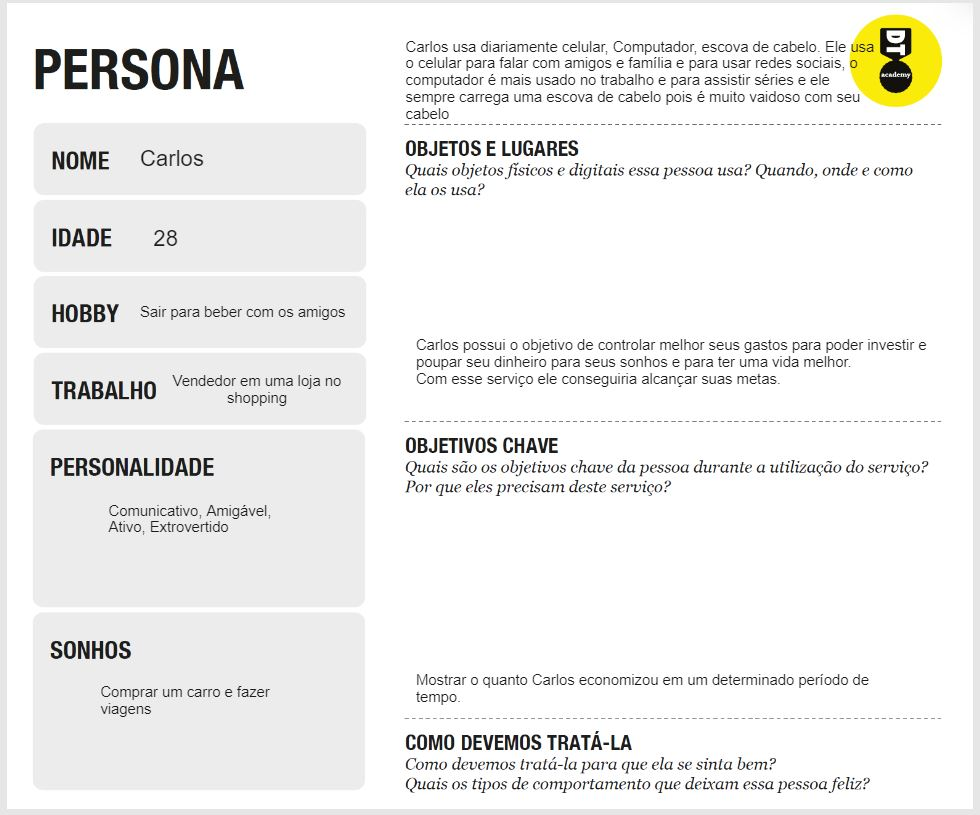
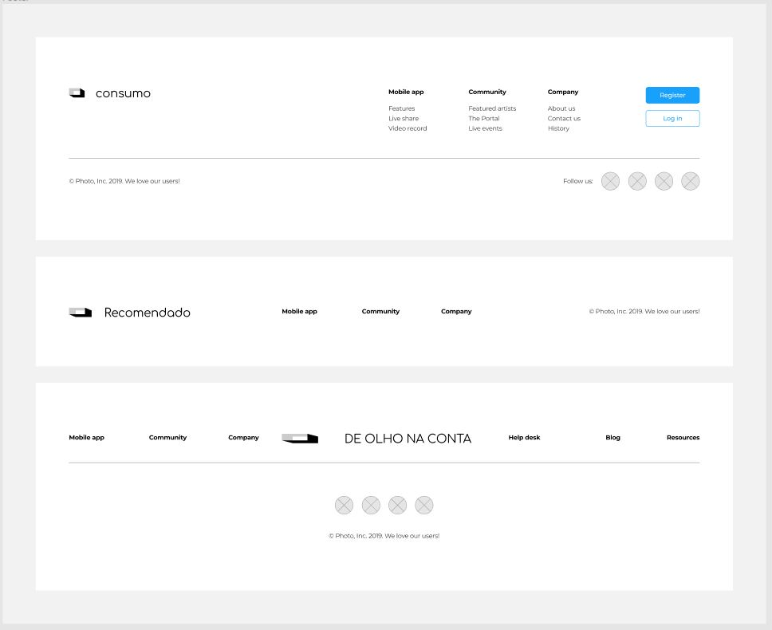
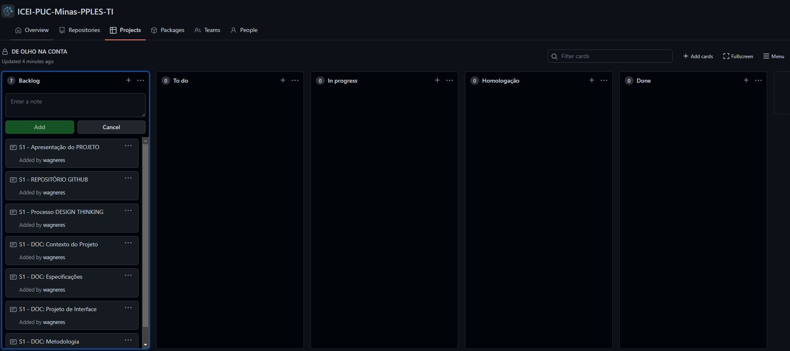
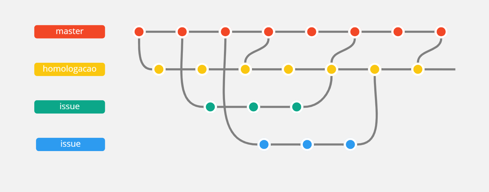

# DE OLHO NA CONTA

Módulo adicional pensado para apoiar pessoas que possuem conta bancária digital, a fim de facilitar na Administração das suas Finanças Pessoais.

`CURSO` 

Engenharia de Software, Unidade Praça da Liberdade, Turno: Noite.

## Participantes

* Eron Panes de Moraes
* Henrique Pinto Santos
* João Pedro Campos de Barcelos
* Pablo Guilherme Amâncio Pereira Magela
* Wagner Rogerio Ferreira Pinheiro

### Professores 

* Joao Luiz Silva Barbosa
* Simone Alves Nogueira

# Estrutura do Documento

- [Informações do Projeto](#informações-do-projeto)
  - [Participantes](#participantes)
- [Estrutura do Documento](#estrutura-do-documento)
- [Introdução](#introdução)
  - [Problema](#problema)
  - [Objetivo](#objetivo-geral)
  - [Justificativa](#justificativa)
  - [Público-Alvo](#público-alvo)
- [Especificações do Projeto](#especificações-do-projeto)
  - [Personas e Mapas de Empatia](#personas-e-mapas-de-empatia)
  - [Histórias de Usuários](#histórias-de-usuários)
  - [Requisitos](#requisitos)
    - [Requisitos Funcionais](#requisitos-funcionais)
    - [Requisitos não Funcionais](#requisitos-não-funcionais)
  - [Restrições](#restrições)
- [Projeto de Interface](#projeto-de-interface)
  - [User Flow](#user-flow)
  - [Wireframes](#wireframes)
- [Metodologia](#metodologia)
  - [Divisão de Papéis](#divisão-de-papéis)
  - [Ferramentas](#ferramentas)
  - [Controle de Versão](#controle-de-versão)
- [*############## SPRINT 1 ACABA AQUI #############*](#-sprint-1-acaba-aqui-)
- [Projeto da Solução](#projeto-da-solução)
  - [Tecnologias Utilizadas](#tecnologias-utilizadas)
  - [Arquitetura da solução](#arquitetura-da-solução)
- [Avaliação da Aplicação](#avaliação-da-aplicação)
  - [Plano de Testes](#plano-de-testes)
  - [Ferramentas de Testes (Opcional)](#ferramentas-de-testes-opcional)
  - [Registros de Testes](#registros-de-testes)
- [Referências](#referências)

# Introdução

Com o isolamento social necessário para o combate a Covid-19, inúmeros problemas foram evidenciados, dentre eles os relacionados a finanças pessoais. Uma pesquisa do Instituto Axxus realizada no Brasil e lançada em 2021, revelou que 76% dos brasileiros não administraram bem as finanças pessoais durante a pandemia. Um aspecto interessante relacionado ao aprendizado dos brasileiros quando o assunto são as finanças, é de que 58% das pessoas entrevistadas, responderam que continuam comprando mais do que o necessário, e mais de 70% decidem como se endividar dependendo do valor da parcela, mesmo que haja juros. Essa pesquisa destaca um retrato pouco positivo de como os brasileiros lidam com seu orçamento.

Fonte: [AXXUS, 2021.](https://www.cnnbrasil.com.br/business/76-dos-brasileiros-nao-administraram-bem-financas-pessoais-durante-a-pandemia/)

## Problema

Um problema enfrentado por pessoa que possuem contas bancárias digitais e que vive de sua própria renda, seja média ou baixa, é a dificuldade de compreensão de como relacionar as causas e os efeitos de seus gastos. Em quais categorias, seja de serviços ou produtos, e o que de forma transparente e objetiva interfere nas decisões financeiras. Nesse contexto, uma questão destaca-se: Quais os efeitos de um monitoramento detalhado dos gastos financeiros sobre a experiência da administração das finanças pessoais de pessoas que utilizam contas bancárias digitais?

## Objetivo geral

O objetivo geral do trabalho é verificar por meio do desenvolvimento de um módulo adicional para aplicativos de bancos digitais os efeitos de um monitoramento detalhado dos gastos financeiros sobre a experiência da administração das finanças pessoais dos clientes digitais.

## Objetivos específicos 

Os objetivos específicos consistem em:
- Identificar quais categorias de consumo são mais frequentes para os clientes digitais;
- Desenvolver métricas da relação entre os valores disponíveis em conta e metas de gastos por categoria;
- Obter modelo de monitoramento via notificações educativas da evolução dos gastos por categorias.

## Justificativa

Como citado nos tópicos anteriores a motivação desse projeto partiu do contexto pouco positivo da situação financeira dos brasileiros. Com recorte para os usuários de contas digitais, seja em bancos ou corretoras, e que apresentam dificuldades em administrar suas finanças pessoais. Esse ponto surgiu não somente nas buscas teóricas realizadas no início desse projeto, mas também, nos relatos de pessoas entrevistadas para levantamento de hipóteses. Onde identificamos uma frequência relevantes (71%) de pessoas que declararam ter interesse ou precisar aprofundar seus conhecimentos em finanças pessoais para uma vida financeiramente mais saudável.   

## Público-Alvo

Usuários de contas bancárias digitais e que são afetadas pela falta de um acompanhamento panorâmico educativo dos seus gastos. Pessoas que possuem pouco ou nenhum entendimento dos seus gastos de maneira categorizada. Bancos e corretoras financeiras digitais que entendem a importância da experiência do cliente para a manutenção da carteira e que com isso possuem o interesse em segmentar serviços direcionados a seus clientes. Desta forma, entende-se como público-alvo pessoas diversas, maiores de idade usuárias de contas bancárias digitais e/ou corretoras financeiras devidamente habilitadas pelo Banco Central do Brasil.

# Especificações do Projeto

Coletamos das informações por meio de entrevistas realizadas presencialmente e via google forms. A partir das respostas conseguimos determinar uma persona e desenhar seu mapa de empatia. A partir daí foi definido os requisitos funcionais e os não funcionais.

## Personas e Mapas de Empatia

> Carlos Plinio da Cunha, 28 anos, vendedor de uma loja no Shopping.
> 1. Comunicativo, Amigável, Ativo, Extrovertido
> 2. Sonha em comprar um carro e fazer viagens
> 3. Usa diariamente o computador

## Histórias de Usuários

Com base na análise das personas forma identificadas as seguintes histórias de usuários:

|EU COMO | QUERO/PRECISO  |PARA                 |
|--------------------|------------------------------------|----------------------------------------|
|Vendedor de Loja  | Orientações via notificações           | Me ajudar a usar melhor o meu dinheiro               |
|Administrador       | Alterar permissões                 | Permitir que possam administrar contas |

## Requisitos

As tabelas que se seguem apresentam os requisitos funcionais e não funcionais que detalham o escopo do projeto.

### Requisitos Funcionais

|ID    | Descrição do Requisito  | Prioridade |
|------|-----------------------------------------|----|
|RF-001| Gerar um relatório de gastos mensais, anuais e semanais | ALTA | 
|RF-002| Mostrar a porcentagem de gastos em cada categoria.(restaurante, mercado, cosméticos...) | ALTA |
|RF-003| Mostrar a porcentagem de gastos com base no valor inicial que o usuário tem na conta | ALTA |
|RF-004| Notificar o usuário sobre seus gastos | ALTA |
|RF-005| Ferramenta para delimitar uma certa quantia que o prórpio usuário deseja gastar até um determinado período | MÉDIA |
|RF-006| Mostrar o valor e a porcentagem sobre o montante final em razão dos valores de entrada e saída | ALTA |
|RF-007| Mostrar o gasto recomendado para cada categoria | ALTA |
|RF-008| Priorizar por peso de importância do gasto em categorias que o próprio usuário delimita | ALTA |

### Requisitos não Funcionais

|ID     | Descrição do Requisito  |Prioridade |
|-------|-------------------------|----|
|RNF-001| Função adicional para aplicativos de banco | ALTA | 
|RNF-002| Pode ser acessado de qualquer plataforma(smartphone, tablet, pc...) | MÉDIA | 
|RNF-003| O cálculo dos gastos deve levar em torno de 2 segundos para ser gerado e mostrado | MÉDIA |

## Restrições

O projeto está restrito pelos itens apresentados na tabela a seguir.

|ID| Restrição                                             |
|--|-------------------------------------------------------|
|01| O projeto deverá ser entregue até o final do semestre |
|02| Não pode ser desenvolvido um módulo de backend        |

# Projeto de Interface

O projeto consiste em telas de notificação de textos pré-definidos por perfil de consumo, usando a identidade visual de cada banco ou corretora digital. E mais 3 telas principais, são elas: 1) Contendo um relatório de gastos mensais, anuais e semanais; 2) Para inserção de pesos de importância definidas pelo próprio usuário por categorias; 3) Contendo as estimativas de gastos e ganhos mais adequados para as metas estabelecidas pelo próprio usuário. 

## Wireframes

# Metodologia

Neste trabalho foi utilizado como metodologia o Design Thinking e o Scrum Framework. O primeiro para identificação e concepção do problema a ser abordado. O segundo, foi utilizado para facilitar a transição entre o desenvolvimento e a fase de concepção observadas no Design Thinking.

## Divisão de Papéis

Definimos pela ferramenta Project do próprio GitHub, para acompanhamento das atividades e para divisão de papéis, utilizamos a pontuação de dificuldade de cada tarefa definida na metodologia Scrum. Dividiu-se as tarefas em grupos de pontuações similares. Assim, cada integrante ficou responsável por um destes grupos de tarefas.

## Ferramentas

| Ambiente  | Plataforma              |Link de Acesso |
|-----------|-------------------------|---------------|
|Processo de Design Thinkgin  | Miro |  https://miro.com/app/board/uXjVOAwChs0=/ | 
|Repositório de código | GitHub | https://github.com/ICEI-PUC-Minas-PPLES-TI/plf-es-2022-1-ti1-7946100-g7-problemas-adm-de-financas.git | 
|Repositório de código | GitHub | https://github.com/ICEI-PUC-Minas-PPLES-TI/plf-es-2022-1-ti1-7946100-g7-problemas-adm-de-financas.git | 
|Protótipo Interativo | MavelApp ou Figma | https://www.figma.com/file/O7dKxbsCO8XQLyYc5kMhD0/Wireframing-in-Figma?node-id=0%3A1 | 

## Controle de Versão
O sistema de versionamento de código é efetuado por meio de Pull Requests e Issues.

* Branch:
	* `master`: versão final do projeto;
	* `homologacao`: versão de testes, pode ocorrer inconsistências com a master;
	* `iss`: branches para o desenvolvedor modificar e criar códigos.

* Pull Request:
	* Ocorre uma vez por semana;
	* Merge das branches iss para a master;
	* Responsabilidade do Scrum Master.
	* utilizam o sistema de labels das issues

* Issue:
	* Criação de uma nova branch para cada issue;
	* Merge em homologação após finalização da issue;
	* Nome "username" + "/" + "issue" + "número do issue";
	* utilizaram o sistema de labels descrito na imagem abaixo:

Logo, o workflow relacionado ao sistema de branches pode ser observado na imagem a seguir:

############### SPRINT 1 ACABA AQUI #############*

# Projeto da Solução

......  COLOQUE AQUI O SEU TEXTO ......

## Tecnologias Utilizadas

......  COLOQUE AQUI O SEU TEXTO ......

> Descreva aqui qual(is) tecnologias você vai usar para resolver o seu
> problema, ou seja, implementar a sua solução. Liste todas as
> tecnologias envolvidas, linguagens a serem utilizadas, serviços web,
> frameworks, bibliotecas, IDEs de desenvolvimento, e ferramentas.
> Apresente também uma figura explicando como as tecnologias estão
> relacionadas ou como uma interação do usuário com o sistema vai ser
> conduzida, por onde ela passa até retornar uma resposta ao usuário.
> 
> Inclua os diagramas de User Flow, esboços criados pelo grupo
> (stoyboards), além dos protótipos de telas (wireframes). Descreva cada
> item textualmente comentando e complementando o que está apresentado
> nas imagens.
## Arquitetura da solução

......  COLOQUE AQUI O SEU TEXTO E O DIAGRAMA DE ARQUITETURA .......

> Inclua um diagrama da solução e descreva os módulos e as tecnologias
> que fazem parte da solução. Discorra sobre o diagrama.
> 
> *Exemplo do diagrama de Arquitetura*:
> 
> 

# Avaliação da Aplicação

......  COLOQUE AQUI O SEU TEXTO ......

> Apresente os cenários de testes utilizados na realização dos testes da
> sua aplicação. Escolha cenários de testes que demonstrem os requisitos
> sendo satisfeitos.
## Plano de Testes

......  COLOQUE AQUI O SEU TEXTO ......

> Enumere quais cenários de testes foram selecionados para teste. Neste
> tópico o grupo deve detalhar quais funcionalidades avaliadas, o grupo
> de usuários que foi escolhido para participar do teste e as
> ferramentas utilizadas.
> 
> *Links Úteis*:
> - [IBM - Criação e Geração de Planos de Teste](https://www.ibm.com/developerworks/br/local/rational/criacao_geracao_planos_testes_software/index.html)
> - [Práticas e Técnicas de Testes Ágeis](http://assiste.serpro.gov.br/serproagil/Apresenta/slides.pdf)
> -  [Teste de Software: Conceitos e tipos de testes](https://blog.onedaytesting.com.br/teste-de-software/)
## Ferramentas de Testes (Opcional)

......  COLOQUE AQUI O SEU TEXTO ......

> Comente sobre as ferramentas de testes utilizadas.
> 
> *Links Úteis*:
> - [Ferramentas de Test para Java Script](https://geekflare.com/javascript-unit-testing/)
> - [UX Tools](https://uxdesign.cc/ux-user-research-and-user-testing-tools-2d339d379dc7)
## Registros de Testes

......  COLOQUE AQUI O SEU TEXTO ......

> Discorra sobre os resultados do teste. Ressaltando pontos fortes e
> fracos identificados na solução. Comente como o grupo pretende atacar
> esses pontos nas próximas iterações. Apresente as falhas detectadas e
> as melhorias geradas a partir dos resultados obtidos nos testes.

# Referências

https://blog.trello.com/br/trello-passo-a-passo 

 

https://www.devmedia.com.br/introducao-ao-scrum/33724 

 

https://www.sebrae.com.br/sites/PortalSebrae/artigos/design-thinking-inovacao-pela-criacao-de-valor-para-o-cliente,c06e9889ce11a410VgnVCM1000003b74010aRCRD 

 

https://www.thinkwithgoogle.com/intl/pt-br/estrategias-de-marketing/apps-e-mobile/ux-user-experience/ 

 

https://developer.mozilla.org/pt-BR/docs/Web/API/Window/localStorage 

 

https://help.miro.com/hc/en-us/categories/360001415214-Getting-Started 

 

https://kanbanize.com/pt/recursos-kanban/primeiros-passos/o-que-e-quadro-kanban 
